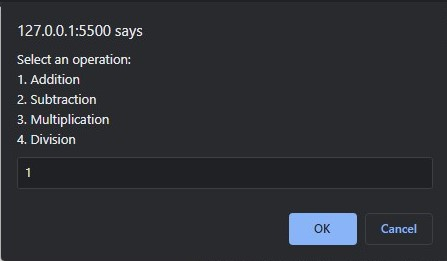
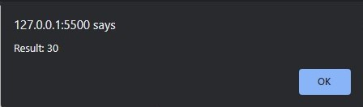
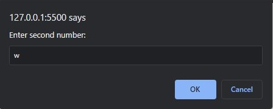
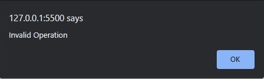

# Exercise description
- Accept two numbers from user.
- Select operation between 1. Addition, 2. Subtraction, 3. Multiplication 4. Division.
- Returns result according to selected operation.

  
  
  
  
  
  
  

- If any of the input is not a number, stops the operation and return "Not a number"
- If non other than (1-4) operation is selected, returns "Invalid Operation"

  
  
  
  
  
  
  