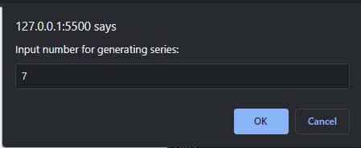
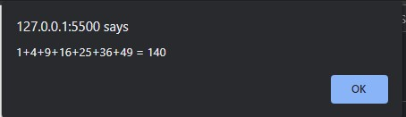
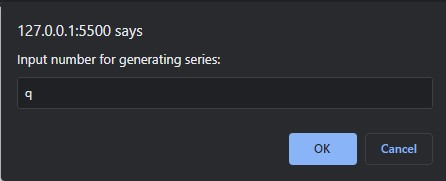
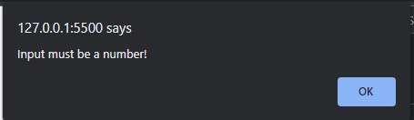

# Exercise description
- Accept a number from user
- Display both the series and their sum

  

  

- If user inputs anything but number, stops the operation and return "Input must be a number!"

  

  
  
