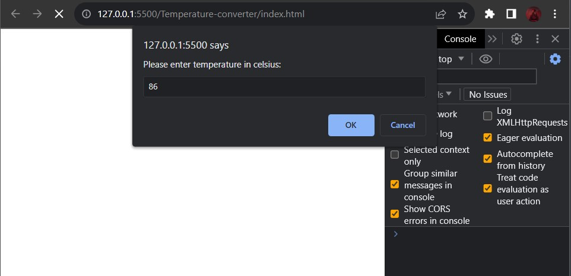
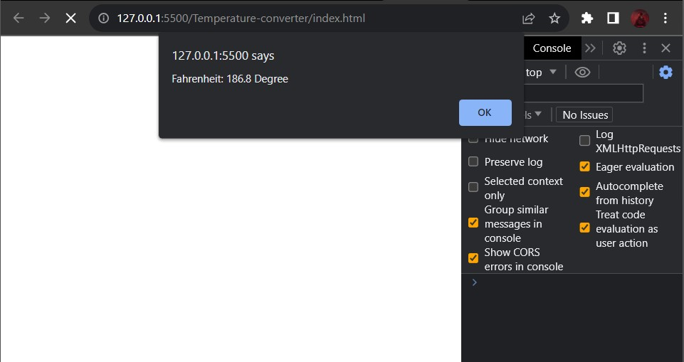
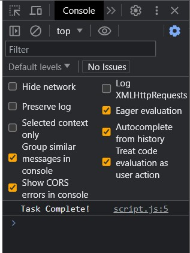

# Exercise description

- Accept a number from user. (Temperature in Celsius)
- Convert it to Fahrenheit (Formula: F = 9/5*C +32)
- Print the Result as alert! ("Fahrenheit: 94 Degree
- Print "Task Complete!" in console</li>

